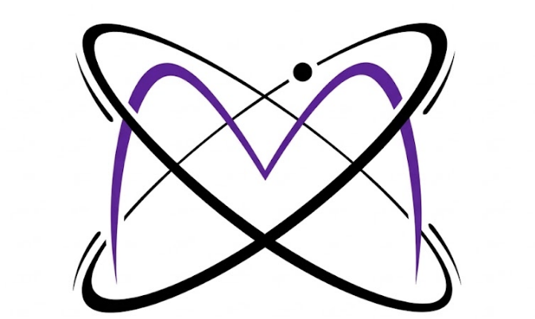

# Methara

**Multi-satellite methane intelligence : from atmospheric signal to operational decision.**

---

Methane monitoring today often stops at detection. Methara goes further.

We are a multi-satellite methane intelligence platform that fuses Earth Observation data from multiple sensors, applies physics-guided geospatial machine learning, and translates atmospheric signals into **actionable climate insights** — for industry, regulators, and climate applications at scale.

---

## The Problem

Methane (CH₄) drives roughly **one third of current global warming**. It is potent, short-lived, and measurable from space, yet most monitoring systems treat detection as the finish line. Raw satellite signals are noisy, sensor coverage is fragmented, and converting a spectral anomaly into a reliable emission estimate at a specific surface source remains an open challenge.

Reliable, scalable, actionable methane intelligence is still missing from most operational workflows.

---

## What Methara Does

Methara closes that gap through a stack of interconnected capabilities:

| Capability | What it means in practice |
|---|---|
| **Multi-sensor data harmonisation** | Ingesting and aligning observations across satellite platforms (Sentinel-5P / TROPOMI, CarbonMapper, and others) so no single sensor's blind spots dominate |
| **Uncertainty-aware plume detection** | Every emission estimate ships with a quantified uncertainty — matched-filter flux (MFA, kg CH₄/hr) cross-validated against IME-based flux (t/hr) |
| **Physics-guided geospatial ML** | Atmospheric dynamics — wind fields, boundary-layer height, terrain — are folded into the model rather than treated as noise |
| **Ensemble learning** | Multiple detection approaches are combined to improve robustness and reduce false-positive rates |
| **Cloud-scale processing pipelines** | Designed from the ground up to run at continental scale without manual intervention |
| **Decision intelligence layer** | Outputs are not just maps — they are ranked, contextualised signals ready for operational use by analysts, regulators, and asset operators |

---

## The Explorer App

This repository contains Methara's **interactive methane intelligence explorer** — a map-based interface for investigating CH₄ anomalies and point-source plume detections across space and time.

### Data layers

**CH₄ Anomaly Grid — Sentinel-5P / TROPOMI**
Annual composite anomaly maps (2019–2025) tessellated into H3 hexagonal cells. Each cell is coloured by mean CH₄ concentration deviation from background (ppb), surfacing regional hotspots that point sensors miss entirely. Scroll the year slider to watch emission patterns evolve.

**Plume Detections — CarbonMapper**
Individual emission events with georeferenced bounding polygons, false-colour SWIR plume imagery overlaid on the basemap, matched-filter absorption flux estimates, and IME cross-validated flux where available. Every detection links sector classification, platform provenance, wind conditions, and detection datetime.

### What you can do

- **Explore** CH₄ anomaly intensity across any region from 2019 to 2025 using the year slider
- **Click any hex cell** to inspect its full suite of co-located geophysical variables: CH₄ anomaly, NDVI, NDBI, NDWI, elevation, slope, wind speed, nightlights, flux proxy, and more
- **Browse the Sources panel** to scroll and select individual plume detections
- **Click any plume** to fly the map to its location, load the SWIR overlay, and compare MFA and IME emission estimates side by side
- **Toggle layers** independently to focus on anomaly context, point sources, or both simultaneously

## Contact & Early Access

Methara is actively engaging with early use cases across industry, climate finance, and regulatory applications.

**LinkedIn:** [Methara](https://www.linkedin.com/company/methara)

---

